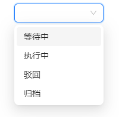
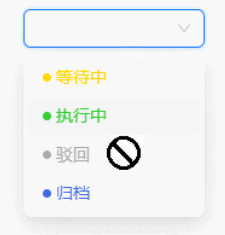

[中文文档](https://github.com/astfn/as-enum/blob/main/docs/DOC.md)

## What

`as-enum` is a simple enumeration management tool designed to help frontend developers easily maintain enum information.

> Naming it as "as" is intended to make it as simple to use as TypeScript enums while supporting even more features, and of course, without compromising on the necessary type hints.
>
> (Incidentally, my name is Ashun 😂, which seems to be a perfect coincidence.)

#### Features

- ☕ Supports rapid generation of `Select` component `options` data source for UI libraries.
  - Default option property names are based on Ant Design (supports configuring property aliases).
- ⚙️ Allows adding custom additional information to each enum item.
- 😄 Supports quickly retrieving enum-related information such as `key`, `value`, `label`, etc.
- ✨ Supports enum values of any type, not limited to string or numeric enums.

- 🎉 Provides excellent type hints in TypeScript projects.

## Why

In our daily frontend development tasks, whether it's writing pure frontend logic or enumerating interface parameters agreed upon with the backend, we often need to define enumerations.

For example, maintaining a dropdown select box (using the antd Select component as an example) that includes options such as: "Pending", "Executed", "Rejected", "Archived".



According to the standard procedure, we need to write the following code (enumeration + dropdown data source).

```
export enum TaskStatusEnum {
  /**
   * 任务等待中，尚未开始执行
   */
  WAITING,
  /**
   * 任务已执行，正在进行中
   */
  EXECUTING,
  /**
   * 任务被驳回，需要重新审视和处理
   */
  REJECTED,
  /**
   * 任务已归档，完成并存档
   */
  ARCHIVED,
}

export const TaskStatusOptions = [
  {
    label: '等待中',
    value: TaskStatusEnum.WAITING,
  },
  {
    label: '执行中',
    value: TaskStatusEnum.EXECUTING,
  },
  {
    label: '驳回',
    value: TaskStatusEnum.REJECTED,
  },
  {
    label: '归档',
    value: TaskStatusEnum.ARCHIVED,
  },
];
```

When you maintain multiple enumerations and dropdown data sources, you may encounter several issues:

1. The writing process becomes cumbersome, as you need to maintain two constants each time (enumeration + data source).
2. The code becomes lengthy, and enum values and their descriptions are not kept together, making maintenance cumbersome.

By using as-enum, you only need to write the following code (which also provides type hints when used):

```
const TaskStatusOptions = asEnum([
  ['WAITING', 0, '等待中'],
  ['EXECUTING', 1, '执行中'],
  ['REJECTED', 2, '驳回'],
  ['ARCHIVED', 3, '归档'],
] as const);
```

Later, as the project iterated, UI suggested some style optimizations. Various status options need to be customized for display, and due to business constraints, the "Rejected" status needs to be disabled:



You need to configure the `color` and `disable` properties in `TaskStatusOptions`.

```
export const TaskStatusOptions = [
  {
    label: '等待中',
    value: TaskStatusEnum.WAITING,
    color: '#FFD700',
  },
  {
    label: '执行中',
    value: TaskStatusEnum.EXECUTING,
    color: '#32CD32',
  },
  {
    label: '驳回',
    value: TaskStatusEnum.REJECTED,
    color: '#aaa',
    disabled: true,
  },
  {
    label: '归档',
    value: TaskStatusEnum.ARCHIVED,
    color: '#4169E1',
  },
];
```

Subsequently, the product team wants to apply this personalized display effect in the task list table as well. To achieve this, we need to do at least two things:

1. When rendering the status column in the table, we need to retrieve corresponding configuration information (such as color, disable status, title, etc.) based on the enum value. To facilitate quicker access to enum information, we are refactoring TaskStatusOptions into an object format.
2. Ensure compatibility with existing code that uses TaskStatusOptions (for generating dropdown options).

At this point, TaskStatusOptions has been refactored as follows:

```
export const TaskStatusOptions = Object.freeze({
  [TaskStatusEnum.WAITING]: {
    label: '等待中',
    value: TaskStatusEnum.WAITING,
    color: '#FFD700',
  },
  [TaskStatusEnum.EXECUTING]: {
    label: '执行中',
    value: TaskStatusEnum.EXECUTING,
    color: '#32CD32',
  },
  [TaskStatusEnum.REJECTED]: {
    label: '驳回',
    value: TaskStatusEnum.REJECTED,
    color: '#aaa',
    disabled: true,
  },
  [TaskStatusEnum.ARCHIVED]: {
    label: '归档',
    value: TaskStatusEnum.ARCHIVED,
    color: '#4169E1',
  },
});
```

With that, the main task is completed. Two months later, the product team found that users are paying more attention to data with the status `In Progress`. Therefore, they want `In Progress` to be the first item in the dropdown data source.

Do you think it's straightforward, just needing to reorder the configuration items?

```
export const TaskStatusOptions = Object.freeze({
  [TaskStatusEnum.EXECUTING]: {……}
  [TaskStatusEnum.WAITING]: {……},
  [TaskStatusEnum.REJECTED]: {……},
  [TaskStatusEnum.ARCHIVED]: {……},
});
```

But to your surprise, you discover that the rendered options are not in the order you configured (due to a native JavaScript behavior: when object properties are string numbers, they are iterated in ascending order).

As a result, you need to make a series of code adjustments 😂.

If you use `as-enum`, however, you only need to write the following code to strictly build the options in the configured order.

```
const TaskStatusOptions = asEnum([
  ['EXECUTING', 1, '执行中', { color: '#32CD32' }],
  ['WAITING', 0, '等待中', { color: '#FFD700' }],
  ['REJECTED', 2, '驳回', { color: '#FFD700', disabled: true }],
  ['ARCHIVED', 3, '归档', { color: '#4169E1' }],
] as const);
```

---

The preceding example simulated real-world business iteration scenarios to illustrate pain points in the maintenance of enumerations. The summary is as follows:

1. The writing process is cumbersome, requiring maintenance of two constants each time (enumeration + data source).

2. Due to the separation of enumeration values and information, subsequent maintenance becomes more complicated.

3. There are too many lines of code, leading to poor readability.

4. During changes, constant compatibility with existing code is necessary.

5. There may be issues with native JavaScript limitations.

Of course, the scenarios above are rough simulations, and actual situations may vary in simplicity or complexity. Additionally, due to differences in coding styles, you may not encounter some of the mentioned issues.

However, through the example provided earlier, you can surely perceive the pain points of maintaining enumeration information in daily tasks, where `as-enum` can be of assistance.

## Quick Start

### Installation

```
npm install as-enum
```

```
pnpm add as-enum
```

```
yarn add as-enum
```

### Basic Enumeration Information

#### key & value

`Array<Tuple<K, V = K>>`

```
const TaskStatusOptions = asEnum([
  ["WAITING", 0],
  ["EXECUTING", 1],
  ["REJECTED", 2],
  ["ARCHIVED", 3]
] as const);
```

Comparing with Native TypeScript Enums

```
export enum TaskStatusEnum {
  /**
   * 等待中
   */
  WAITING,
  /**
   * 已执行
   */
  EXECUTING,
  /**
   * 被驳回
   */
  REJECTED,
  /**
   * 已归档
   */
  ARCHIVED,
}
```

Accessing enum values is similar to native TypeScript enums, where you can retrieve configuration information by accessing the corresponding property names `asEnumObj.key.value`

```
TaskStatusOptions.EXECUTING.value //1
```

If you want the keys and values of the enum to be identical, you can directly omit the second parameter (value) in the tuple configuration. The value will automatically inherit the key's value.

```
const TaskStatusOptions = asEnum([
  ["EXECUTING"],
  ["WAITING"],
  ["REJECTED"],
  ["ARCHIVED"]
] as const);
```

#### lable

`Array<Tuple<K, V = K, L = K>>`

You can set the label by configuring the third parameter of the tuple.

Purpose of label:

1. When generating the options data source for a Select component, it displays the option names shown to users.
2. It serves as annotation information similar to what you would configure in native TypeScript enums, providing detailed meanings behind the enum values.

Of course, many enums are already sufficiently semantic when defining keys. If you want the label to be identical to the key's value, you can omit the label configuration.

```
const TaskStatusOptions = asEnum([
  ["WAITING", 0, "等待中"],
  ["EXECUTING", 1, "执行中"],
  ["REJECTED", 2, "驳回"],
  ["ARCHIVED", 3, "归档"]
] as const);
```

```
TaskStatusOptions.WAITING.label	// "等待中"
```

Just like `value`, `label` inherits the value of `key` by default.

```
const TaskStatusOptions = asEnum([
  ["WAITING", 0],
  ["EXECUTING", 1],
  ["REJECTED", 2],
  ["ARCHIVED", 3]
] as const);
```

```
TaskStatusOptions.WAITING.label	// "WAITING"
```

#### extra Info

`Array<Tuple<K, V = K, L = K, Extra = object>>`

If you wish to provide additional information for the enum, you can configure it using the fourth parameter of the tuple.

```
const TaskStatusOptions = asEnum([
  ["WAITING", 0, "等待中", { color: "#FFD700", disabled: false }],
  ["EXECUTING", 1, "执行中", { color: "#32CD32", disabled: false }],
  ["REJECTED", 2, "驳回", { color: "#FFD700", disabled: true }],
  ["ARCHIVED", 3, "归档", { color: "#4169E1", disabled: false }]
] as const);
```

Accessing additional information can still be done through the key (with type hints available during actual usage).

```
TaskStatusOptions.WAITING.color;	// "#FFD700"
TaskStatusOptions.REJECTED.disabled;// true
```

### Complex type Enum

#### complex type enum values

Native TypeScript enums only support two formats: string enums and numeric enums (composite enums being a combined usage of both).

`as-enum` allows defining enum values of any type. Precisely because of this, this tool will support more complex usage scenarios. Whenever you have a need to maintain mapping relationship information, `as-enum` might be able to help you.

#### complex type enum keys

`as-enum` also breaks away from the traditional enum key limitations and can be any type of data structure.

However, if your key is a complex type (neither string nor number), [you'll need to utilize additional APIs to retrieve related enum information and benefit from type validation](####Handling keys of complex type enums)

### Type hinting

#### assisted by `as const`, aids in type inference.

When configuring enum information using `as-enum`, it's necessary to force inference into constants to achieve a nearly perfect type hinting experience.

```
const EnumOptions = asEnum([……] as const);
```

#### Handling scenarios where additional information attributes are inconsistent

For example, when the enum's additional information includes a `disabled` attribute.

```
const TaskStatusOptions = asEnum([
  ["WAITING", 0, "等待中", { color: "#FFD700", disabled: false }],
  ["EXECUTING", 1, "执行中", { color: "#32CD32", disabled: false }],
  ["REJECTED", 2, "驳回", { color: "#FFD700", disabled: true }],
  ["ARCHIVED", 3, "归档", { color: "#4169E1", disabled: false }]
] as const);
```

If you don't intend to set the `disabled` property for every option, you will handle cases where `disabled` is `undefined` at the point of usage.

```
const TaskStatusOptions = asEnum([
  ['EXECUTING', 1, '执行中', { color: '#32CD32' }],
  ['WAITING', 0, '等待中', { color: '#FFD700' }],
  ['REJECTED', 2, '驳回', { color: '#FFD700', disabled: true }],
  ['ARCHIVED', 3, '归档', { color: '#4169E1' }],
] as const);
```

However, you may find that when accessing enum information further via `TaskStatusOptions.key`, you lose type hints (due to TypeScript's type inference limitations).

In this case, you can create enum additional information using a factory function with types. This allows you to experience normal type hinting effects afterwards.

```
const createExraInfo = (params: { color: string; disabled?: boolean }) => params;

const TaskStatusOptions = asEnum([
  ["WAITING", 0, "等待中", createExraInfo({ color: "#FFD700" })],
  ["EXECUTING", 1, "执行中", createExraInfo({ color: "#32CD32" })],
  ["REJECTED", 2, "驳回", createExraInfo({ color: "#FFD700", disabled: true })],
  ["ARCHIVED", 3, "归档", createExraInfo({ color: "#4169E1" })]
] as const);
```

#### Handling keys of complex type enums

When configuring enum keys as complex types (not strings or numbers), it's evident that `as-enum` does not add them as property names to the returned results.

In such cases, you can utilize [API](##api) like `valueByKey`, `labelByKey`, and `infoByKey` to retrieve enum information based on the key, ensuring type validation.

#### Obtaining the type of an enum value

**typeof asEnumObj.\_key_type**

If you want to obtain the enumeration key type of the configuration, you can achieve it through this method.

**typeof asEnumObj.\_possible_v_type**

Used to obtain the type for all possible enum values, which includes all enum keys.

> When an enumeration's `value` is not explicitly configured, the `value` will automatically inherit the value of its `key`.

**typeof asEnumObj.\_strict_v_type**

If you want to obtain the strict enum value type, you can achieve this through this method.

> `typeof asEnumObj._strict_v_type` will infer strictly based on the configured value. If no value is configured, the type will be inferred as `undefined`.

**typeof asEnumObj.\_extra_info_type**

If you want to obtain the type of additional information about the configuration, you can achieve it through this method.

## api

### Retrieve Iteration Information

| Property Name, | Type                   | Function Description            |
| -------------- | ---------------------- | ------------------------------- |
| keys           | `Array<EnumKeyType>`   | Retrieve All Enumeration Keys   |
| values         | `Array<EnumValueType>` | Retrieve All Enumeration Values |
| labels         | `Array<EnumLabelType>` | Retrieve All Enumeration Labels |

#### genOptions

`type TOptionAttrsAlias = { labelAlias: string; valueAlias: string };`

`genOptions(params?: Partial<TOptionAttrsAlias>): any[]`

Used as the data source for generating options for the Select component, with option attribute names defaulting to Ant Design (label, value). If you're using a different UI library, you can configure alias information when calling `genOptions` to adapt accordingly.

##### Caching Feature

`genOptions` possesses a caching feature, where new options are only generated when the alias for options is updated. Otherwise, multiple calls to `genOptions` will return the same reference object.

### Retrieve information for a specific configuration

#### Retrieve related configuration information based on enumeration key

| Method Name    | Type                                                                                                | Function Description                                                     |
| -------------- | --------------------------------------------------------------------------------------------------- | ------------------------------------------------------------------------ |
| valueByKey     | `(key: EnumKeyType)=> EnumValueType`                                                                | Retrieve value based on key                                              |
| labelByKey     | `(key: EnumKeyType)=> EnumLabelType`                                                                | Retrieve label based on key                                              |
| extraInfoByKey | `(key: EnumKeyType)=> EnumExtraInfoType`                                                            | Retrieve additional information for extra configuration based on the key |
| infoByKey      | `(key: EnumKeyType)=> { value: EnumValueType; label: EnumLabelType; extraInfo: EnumExtraInfoType }` | Retrieve all enumeration information based on key                        |

#### Retrieve related configuration information based on enumeration value

| Method Name      | Type                                                                                                       | Function Description                                                       |
| ---------------- | ---------------------------------------------------------------------------------------------------------- | -------------------------------------------------------------------------- |
| labelByValue     | `(value: _possible_v_type)=> EnumLabelType`                                                                | Retrieve label based on value                                              |
| keyByValue       | `(value: _possible_v_type)=> EnumLabelType`                                                                | Retrieve key based on value                                                |
| extraInfoByValue | `(value: _possible_v_type)=> EnumExtraInfoType`                                                            | Retrieve additional information for extra configuration based on the value |
| infoByValue      | `(value: _possible_v_type)=> { value: EnumValueType; label: EnumLabelType; extraInfo: EnumExtraInfoType }` | Retrieve all enumeration information associated with the given value       |

## x-enum

If the business scenarios of your project are relatively simple and are expected to remain so in the foreseeable future, you can also use this enumeration library.

This library is an adaptation of x-enum. Due to the need to support new features and provide better type hinting, there are some differences in the underlying code design, and the usage form of the tool has also changed. As a result, the author did not choose to submit a pull request (PR) to modify x-enum directly.

Lastly, I would like to express my gratitude to the original author, @xliez, for creating this small yet elegant tool, which significantly enhances work efficiency. After extensive use, the author of this library realized that to cope with more complex scenarios, the functionality of the tool needed to be iterated upon, leading to the creation of as-enum.
