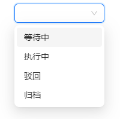
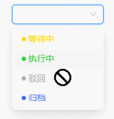

[English Doc](https://github.com/astfn/as-enum/blob/main/docs/DOC.EN.md)

## What

 `as-enum` 是一个简单的枚举管理工具，能够让前端开发者更加方便的维护枚举信息。

>以 as 命名，希望像使用 ts 枚举一样简单的同时，支持更多功能，并且该有的类型提示也不能少。
>
>(其次，我叫 Ashun 😂，简直是不谋而合)	

#### 特性

* ☕ 支持快速生成 ui 库 `Select` 组件的 `options` 数据源
  * 默认生成的 options 属性名以 antd 为准（支持配置属性别名）
* ⚙️ 支持为各项枚举添加自定义的附加信息
* 😄 支持快速获取枚举的 `key`、`value`、`label` 等相关信息。
* ✨ 支持任意类型枚举值，不仅仅局限于字符串、数字枚举

- 🎉 在 ts 项目中, 有良好的类型提示

## Why

​	在日常的前端开发工作中，不论是编写纯前端逻辑，还是与后端约定的接口参数枚举，我们都要编写枚举。

​	例如维护一个下拉选择框（以使用 antd  Select 组件为例），它包含几个选项：等待中、已执行、被驳回、已归档。



按照标准的流程，我们需要编写以下代码（枚举 + 下拉数据源）

```
export enum TaskStatusEnum {
  /**
   * 任务等待中，尚未开始执行
   */
  WAITING,
  /**
   * 任务已执行，正在进行中
   */
  EXECUTING,
  /**
   * 任务被驳回，需要重新审视和处理
   */
  REJECTED,
  /**
   * 任务已归档，完成并存档
   */
  ARCHIVED,
}

export const TaskStatusOptions = [
  {
    label: '等待中',
    value: TaskStatusEnum.WAITING,
  },
  {
    label: '执行中',
    value: TaskStatusEnum.EXECUTING,
  },
  {
    label: '驳回',
    value: TaskStatusEnum.REJECTED,
  },
  {
    label: '归档',
    value: TaskStatusEnum.ARCHIVED,
  },
];
```

当你多维护几个枚举和下拉数据源时，你会发现一些问题：

1. 编写过程太麻烦，每次都要维护两个常量（枚举 + 数据源）
2. 代码行数过多，并且枚举值和枚举信息没有维护在一起，后续维护起来比较麻烦

如果使用 as-enum，你只需要编写以下代码即可（在使用时，也具有类型提示哦~）

```
const TaskStatusOptions = asEnum([
  ['WAITING', 0, '等待中'],
  ['EXECUTING', 1, '执行中'],
  ['REJECTED', 2, '驳回'],
  ['ARCHIVED', 3, '归档'],
] as const);
```

之后，随着项目的迭代，ui 提出了一些样式优化，各种状态选项需要个性化展示，并且由于业务限制，已驳回的状态需要被禁用：



你就需要在 TaskStatusOptions 配置 corlor、disable 属性

```
export const TaskStatusOptions = [
  {
    label: '等待中',
    value: TaskStatusEnum.WAITING,
    color: '#FFD700',
  },
  {
    label: '执行中',
    value: TaskStatusEnum.EXECUTING,
    color: '#32CD32',
  },
  {
    label: '驳回',
    value: TaskStatusEnum.REJECTED,
    color: '#aaa',
    disabled: true,
  },
  {
    label: '归档',
    value: TaskStatusEnum.ARCHIVED,
    color: '#4169E1',
  },
];
```

随后，产品希望在任务列表 Table 中也沿用这种个性化展示的效果。为此我们至少要做两件事：

1. 在渲染表格中的状态列时，需要根据枚举值拿到对应的配置信息(color、disable、title 等)。为了更加快捷的获取对应枚举的信息，因此就要把 TaskStatusOptions 重构成 object
2. 兼容重构之前使用 TaskStatusOptions 的代码（下拉选项的生成） 

此时，TaskStatusOptions 已经变成了这样

```
export const TaskStatusOptions = Object.freeze({
  [TaskStatusEnum.WAITING]: {
    label: '等待中',
    value: TaskStatusEnum.WAITING,
    color: '#FFD700',
  },
  [TaskStatusEnum.EXECUTING]: {
    label: '执行中',
    value: TaskStatusEnum.EXECUTING,
    color: '#32CD32',
  },
  [TaskStatusEnum.REJECTED]: {
    label: '驳回',
    value: TaskStatusEnum.REJECTED,
    color: '#aaa',
    disabled: true,
  },
  [TaskStatusEnum.ARCHIVED]: {
    label: '归档',
    value: TaskStatusEnum.ARCHIVED,
    color: '#4169E1',
  },
});
```

至此，大功告成。又过了两个月，产品发现用户更加关注状态为 `执行中` 的数据，因此希望，让 `执行中` 在下拉数据源的第一项。

你觉得这很简单，只需要改一下配置项的顺序即可？

```
export const TaskStatusOptions = Object.freeze({
  [TaskStatusEnum.EXECUTING]: {……}
  [TaskStatusEnum.WAITING]: {……},
  [TaskStatusEnum.REJECTED]: {……},
  [TaskStatusEnum.ARCHIVED]: {……},
});
```

但是你惊讶的发现，渲染的 options 并不会按照你配置的顺序进行（原生 js 的特性: 当 object 的属性为字符串数字时，会按照递增的顺序迭代）

为此，你又要对代码进行一系列的改动😂

如果使用了  `as-enum` 你只需要编写以下代码即可，选项生成的顺序，严格按照配置顺序构建。

```
const TaskStatusOptions = asEnum([
  ['EXECUTING', 1, '执行中', { color: '#32CD32' }],
  ['WAITING', 0, '等待中', { color: '#FFD700' }],
  ['REJECTED', 2, '驳回', { color: '#FFD700', disabled: true }],
  ['ARCHIVED', 3, '归档', { color: '#4169E1' }],
] as const);
```

---

​	上文通过模拟实际的业务迭代场景，来体现日常枚举维护过程中的痛点，总结如下：

1. 编写过程太麻烦，每次都要维护两个常量（枚举 + 数据源）
2. 并且由于枚举值和枚举信息没有维护在一起，后续维护起来比较麻烦
3. 代码行数过多，可读性差
4. 改动过程中，还需要不断兼容既有代码
5. 可能会遇到原生 js 的限制问题

   当然了，上面的场景只是粗略的模拟，实际情况可能更加简单，也可能更加复杂。并且，由于每个人代码编写风格的差异，也许你并不会遇到上述的某些问题。

​	但通过上文的例子，相信你一定能感知到日常维护枚举信息的痛点，`as-enum` 能够帮到你。

## 快速上手

### 安装

```
npm install as-enum
```

```
pnpm add as-enum
```

```
yarn add as-enum
```


### 基础枚举信息

#### key & value

`Array<Tuple<K, V = K>>`

```
const TaskStatusOptions = asEnum([
  ["WAITING", 0],
  ["EXECUTING", 1],
  ["REJECTED", 2],
  ["ARCHIVED", 3]
] as const);
```

对比原生 ts 枚举

```
export enum TaskStatusEnum {
  /**
   * 等待中
   */
  WAITING,
  /**
   * 已执行
   */
  EXECUTING,
  /**
   * 被驳回
   */
  REJECTED,
  /**
   * 已归档
   */
  ARCHIVED,
}
```

 访问枚举值的形式与原生 ts 枚举相似，可通过访问对应的属性名获取配置信息 `asEnumObj.key.value`

```
TaskStatusOptions.EXECUTING.value //1
```

若希望枚举的 key 与 value 是一致的，可以直接省略元组第二个参数（value）的配置，value 将自动继承 key 的值。

```
const TaskStatusOptions = asEnum([
  ["EXECUTING"],
  ["WAITING"],
  ["REJECTED"],
  ["ARCHIVED"]
] as const);
```


#### lable

`Array<Tuple<K, V = K, L = K>>`

可通过配置元组的第三个参数，实现 label 的设置。

label 的作用：

1. 生成 Select 组件的 options 数据源时，展示给用户的选项名称
2. 相当于配置原生 ts 枚举时的注释信息，枚举背后的详细含义

当然了，很多枚举在定义 key 时，就已经足够语义化了，如果期望 label 与 key 的值保持一致，则不配置 lable 即可。

```
const TaskStatusOptions = asEnum([
  ["WAITING", 0, "等待中"],
  ["EXECUTING", 1, "执行中"],
  ["REJECTED", 2, "驳回"],
  ["ARCHIVED", 3, "归档"]
] as const);
```

```
TaskStatusOptions.WAITING.label	// "等待中"
```

与 value 一样，label 默认继承 key 的值。

```
const TaskStatusOptions = asEnum([
  ["WAITING", 0],
  ["EXECUTING", 1],
  ["REJECTED", 2],
  ["ARCHIVED", 3]
] as const);
```

```
TaskStatusOptions.WAITING.label	// "WAITING"
```

#### extra Info

`Array<Tuple<K, V = K, L = K, Extra = object>>`

如果期望给枚举配置更多的附加信息，可通过元组的第四个参数进行配置

```
const TaskStatusOptions = asEnum([
  ["WAITING", 0, "等待中", { color: "#FFD700", disabled: false }],
  ["EXECUTING", 1, "执行中", { color: "#32CD32", disabled: false }],
  ["REJECTED", 2, "驳回", { color: "#FFD700", disabled: true }],
  ["ARCHIVED", 3, "归档", { color: "#4169E1", disabled: false }]
] as const);
```

附加信息的访问，依旧可通过 key 获取（实际使用时具有类型提示哦~）

```
TaskStatusOptions.WAITING.color;	// "#FFD700"
TaskStatusOptions.REJECTED.disabled;// true
```


### 复杂类型枚举

#### 复杂类型枚举值

原生 ts 的枚举只支持两种格式：字符串枚举、数字枚举（复合枚举是二者的综合使用形式）

`as-enum` 允许定义任意类型的枚举值，也正是因为如此，本工具将支持更复杂的使用场景，只要你有维护映射关系信息的需要，`as-enum` 也许都能帮到你。

#### 复杂类型枚举键

`as-enum` 也突破了传统枚举对于 key 的限制，也可以是任意类型的数据结构。

当然了，如果你的 key 是复杂类型（非 string、非 number），[此时需要利用额外的 api 获取相关枚举信息，并享有类型校验](####处理复杂类型枚举键)


### 类型提示

#### as const 协助类型推断

在使用 `as-enum` 配置枚举信息时，需要强制推断成常量，方可获取近乎完美的类型提示体验

```
const EnumOptions = asEnum([……] as const);
```

#### 处理附加信息属性不一致的情景

例如枚举附加信息中具有 disabled 属性

```
const TaskStatusOptions = asEnum([
  ["WAITING", 0, "等待中", { color: "#FFD700", disabled: false }],
  ["EXECUTING", 1, "执行中", { color: "#32CD32", disabled: false }],
  ["REJECTED", 2, "驳回", { color: "#FFD700", disabled: true }],
  ["ARCHIVED", 3, "归档", { color: "#4169E1", disabled: false }]
] as const);
```

如果你不期望为每一个 option 都设置 disabled 属性，你会在将要使用的地方自行处理 disabled 为 undefined 的情况。

```
const TaskStatusOptions = asEnum([
  ['EXECUTING', 1, '执行中', { color: '#32CD32' }],
  ['WAITING', 0, '等待中', { color: '#FFD700' }],
  ['REJECTED', 2, '驳回', { color: '#FFD700', disabled: true }],
  ['ARCHIVED', 3, '归档', { color: '#4169E1' }],
] as const);
```

但此时你发现通过 TaskStatusOptions.key 进一步访问枚举信息时，丢失了类型提示（这受限于 ts 的类型反推）

此时，你可以通过一个带有类型的工厂函数创建枚举的附加信息。之后你便可以正常的体验类型提示效果。

```
const createExraInfo = (params: { color: string; disabled?: boolean }) => params;

const TaskStatusOptions = asEnum([
  ["WAITING", 0, "等待中", createExraInfo({ color: "#FFD700" })],
  ["EXECUTING", 1, "执行中", createExraInfo({ color: "#32CD32" })],
  ["REJECTED", 2, "驳回", createExraInfo({ color: "#FFD700", disabled: true })],
  ["ARCHIVED", 3, "归档", createExraInfo({ color: "#4169E1" })]
] as const);
```

#### 处理复杂类型枚举键

当你配置枚举键为复杂类型时（非 string、非 number）。很显然，`as-enum` 是不会将其作为属性名添加到返回结果上的。

此时，你可通过 valueByKey、labelByKey、infoByKey，这些 [api](##api)，根据 key 获取枚举信息，享有类型校验。

#### 获取枚举值的类型

**typeof asEnumObj._possible_v_type**

用于获取所有可能的枚举值类型，这将包含所有枚举的 key。

>因为当不配置枚举的 value 时，value 的值将自动继承 key 的值

**typeof asEnumObj._strict_v_type**

如果你想获取严格的枚举 value 类型，可以通过该方式实现。

>`typeof asEnumObj._strict_v_type` 将严格按照配置的 value 进行推断，如果你没有配置 value，则类型将会推断为 `undefined`。 

**typeof asEnumObj._extra_info_type**

如果你想获取配置的附加信息类型，可以通过该方式实现。

## api

### 获取迭代信息

| 属性名 | 类型                   | 功能描述             |
| ------ | ---------------------- | -------------------- |
| keys   | `Array<EnumKeyType>`   | 获取枚举所有的 key   |
| values | `Array<EnumValueType>` | 获取枚举所有的 value |
| labels | `Array<EnumLabelType>` | 获取枚举所有的 label |

#### genOptions

`type TOptionAttrsAlias = { labelAlias: string; valueAlias: string };`

`genOptions(params?: Partial<TOptionAttrsAlias>): any[]`

用于生成 Select 组件的 options 数据源，option 的属性名默认以 antd 为准（label、value），如果你使用其他 ui 库，可在调用 genOptions 时，传入别名信息进行配置。

##### 缓存特性

​	`genOptions` 具有缓存的特性，只有当选项别名更新时，才会生成新的 options，否则多次调用，返回的是同一引用对象。


### 获取某个配置的信息

#### 根据枚举 key 获取相关配置信息

| 方法名         | 类型                                                         | 功能描述                        |
| -------------- | ------------------------------------------------------------ | ------------------------------- |
| valueByKey     | `(key: EnumKeyType)=> EnumValueType`                         | 根据 key 获取 value             |
| labelByKey     | `(key: EnumKeyType)=> EnumLabelType`                         | 根据 key 获取 label             |
| extraInfoByKey | `(key: EnumKeyType)=> EnumExtraInfoType`                     | 根据 key 获取额外配置的附加信息 |
| infoByKey      | `(key: EnumKeyType)=> { value: EnumValueType; label: EnumLabelType; extraInfo: EnumExtraInfoType }` | 根据 key 获取所有枚举信息       |

#### 根据枚举 value 获取相关配置信息

| 方法名           | 类型                                                         | 功能描述                          |
| ---------------- | ------------------------------------------------------------ | --------------------------------- |
| labelByValue     | `(value: _possible_v_type)=> EnumLabelType`                  | 根据 value 获取 label             |
| keyByValue       | `(value: _possible_v_type)=> EnumLabelType`                  | 根据 value 获取 key               |
| extraInfoByValue | `(value: _possible_v_type)=> EnumExtraInfoType`              | 根据 value 获取额外配置的附加信息 |
| infoByValue      | `(value: _possible_v_type)=> { value: EnumValueType; label: EnumLabelType; extraInfo: EnumExtraInfoType }` | 根据 value 获取所有枚举信息       |


## x-enum

如果你维护项目的业务场景比较简单，并且在可预测的未来也是如此，也可以使用该枚举库。

本库就是对 x-enum 的改造，由于需要支持新的功能以及更好的类型提示，导致在代码底层设计上有些不同，且工具的使用形式也发生了改变，因此作者并没有选择在 x-enum 上提 pr 进行改造

最后，感谢原作者 @xliez, 封装这个小而美的工具，能够很好的提升工作效率，本库作者也是在大量使用后，感知到为了应对更复杂的场景，需要对该工具的功能进行迭代，因此才产生了 as-enum。